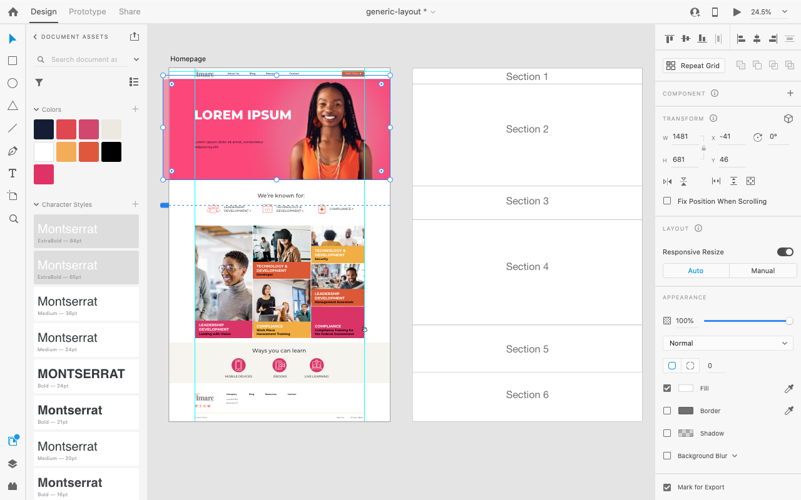
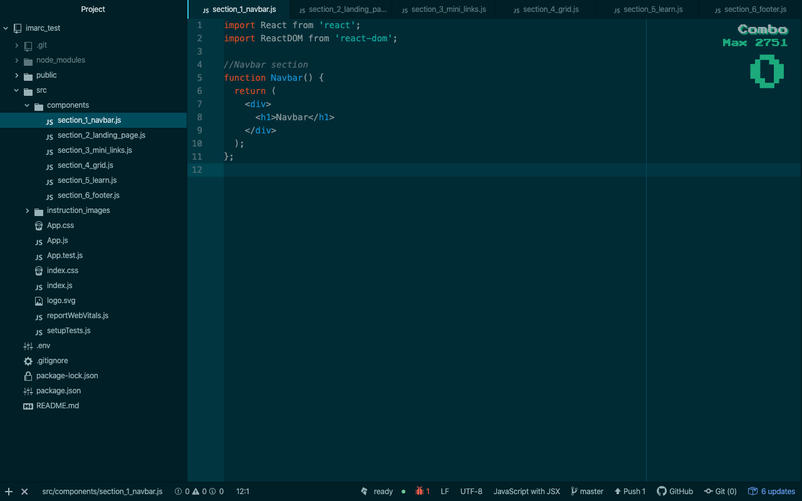
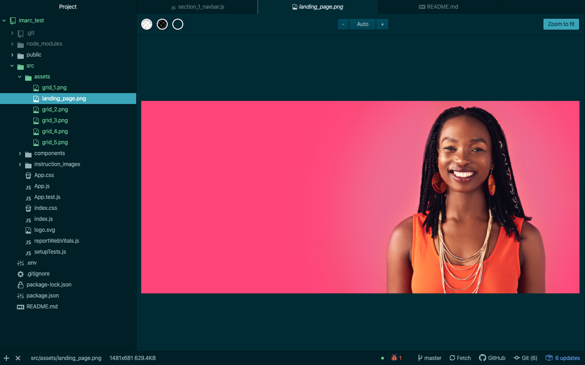
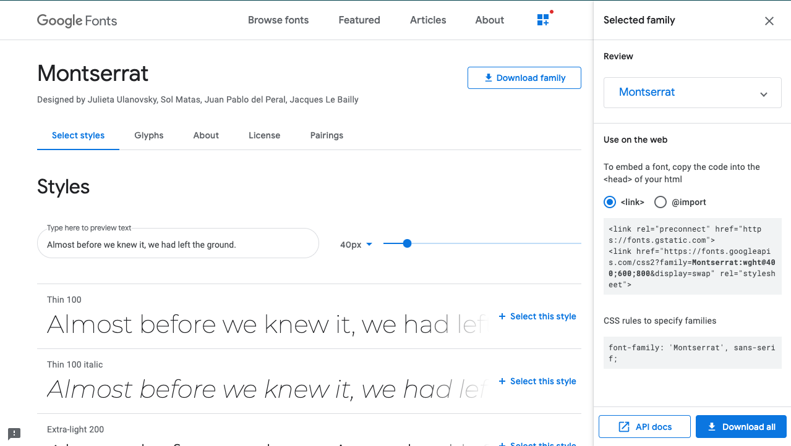
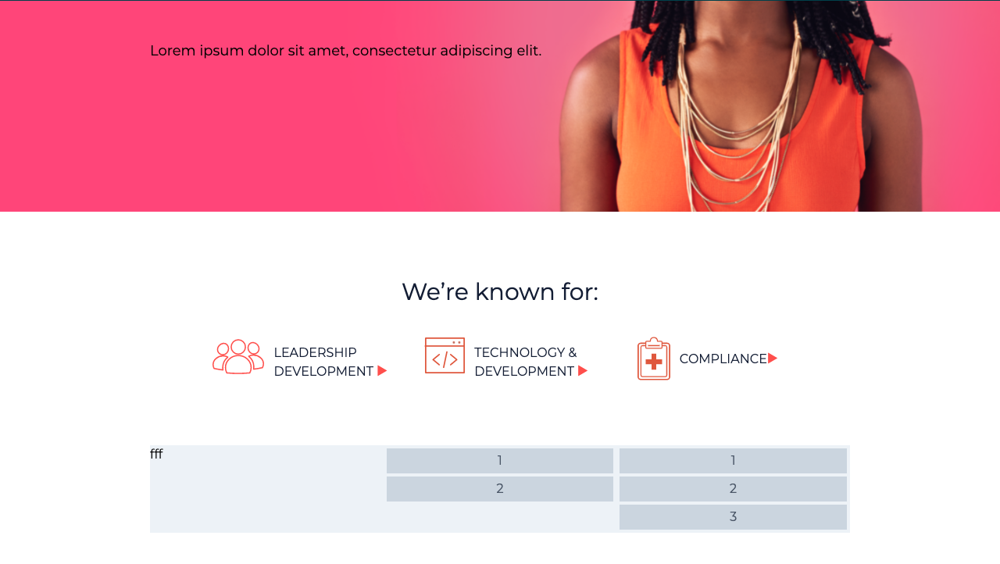
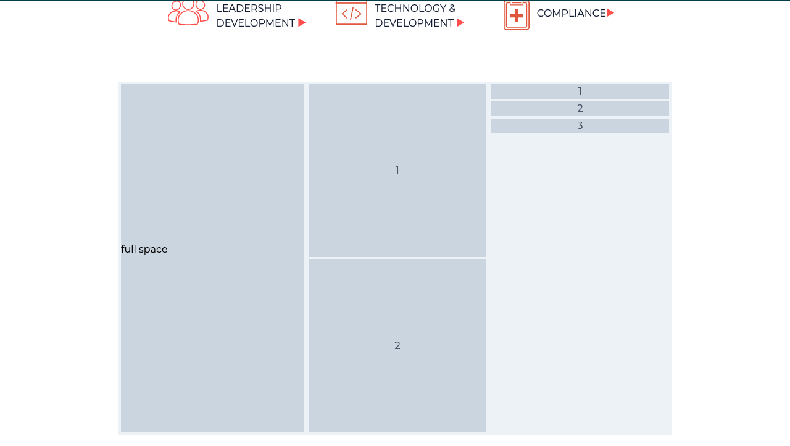

## Hello!
This will be your guide to show you my thought process when handling this task. It's a long one but it will give you a very detailed description of what I did.

### Served and deployed on...
Github | Heroku

### Tech used on this site:
* React
* TailwindCSS
* Adobe XD
* Github

### Step 1
I checked the file and separated them into sections that will be converted to components.

### Step 2
Created those components and named them after the sections from adobe for easier documenting.

### Step 3
Imported assets from adobe xd that will be used in components.

### Step 4
Imported fonts for the page.

### Step 5
Began buidling up the components section by section from 1 through 6, the commits has more detailed descriptions about the individual code.

### Step 6
Because I was using TailwindCSS, it was really easy creating grids using flexbox that matched the description strikingly.

### Step 7
It is pausible to create responsive components thanks to the grid and flexbox system offered by tailwind. We can go alot deeper on this topic but this is a short project.

### Step 8
Prepared the project for deployment on Heroku.

## Here's my contact info in case you have more queries.
* **[stevemarvins.dev@gmail.com](https://www.stevemarvins.dev@gmail.com/)**
* **[LinkedIn](https://www.linkedin.com/in/stevemarvins-dev)**
